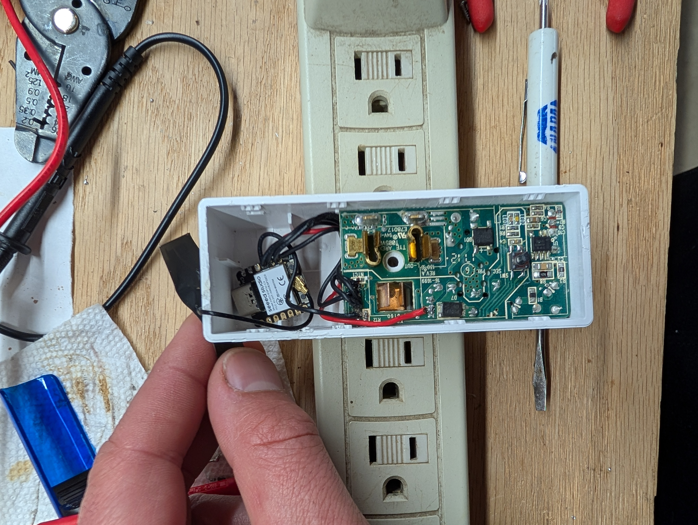

# OmewEmohpse
I analyzed the pinout for the wemo mini so I could install a esp32-c3 with esphome. 

This has only been tested with a seeed [esp32-c3]((https://wiki.seeedstudio.com/XIAO_ESP32C3_Getting_Started/)).
To power the [esp32-c3]((https://wiki.seeedstudio.com/XIAO_ESP32C3_Getting_Started/)) from the wemo board connect 3.3v and GND to the battery connector on the underside of the board. In testing, connecting to the 5V pin or 3.3V pin would not power the c3 properly.
